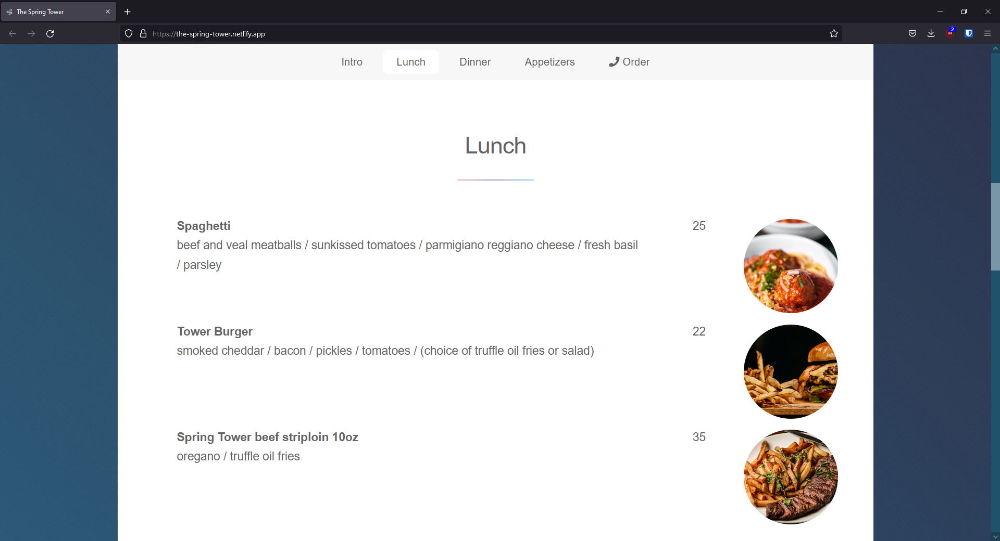
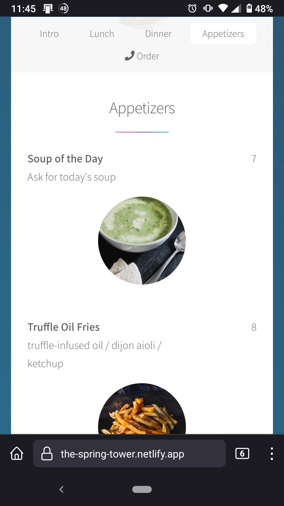

# 

Restaurant website with responsive menu.

**[Visit Here](https://the-spring-tower.netlify.app/)** 

| Desktop | Mobile |
|---|---|
|  |  |

## How It's Made:

**Tech used:**   

## Features:
1. Responsive Design
2. Menu items display enlarged image when clicked

## Optimizations

## Lessons Learned:
If I had more time, I would rewrite this static website using a framework to reduce code redundancy. The headers and footers on the 2 `html` pages are repeated, creating friction when updating content. Additionally, I would like to extend the enlarge image functionality from clicking the Menu name to the menu image, but did not due to the redundant source links.

